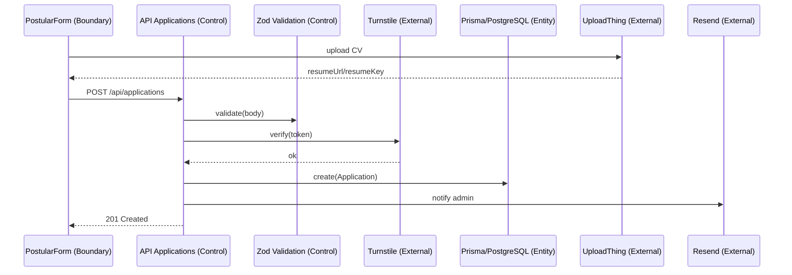
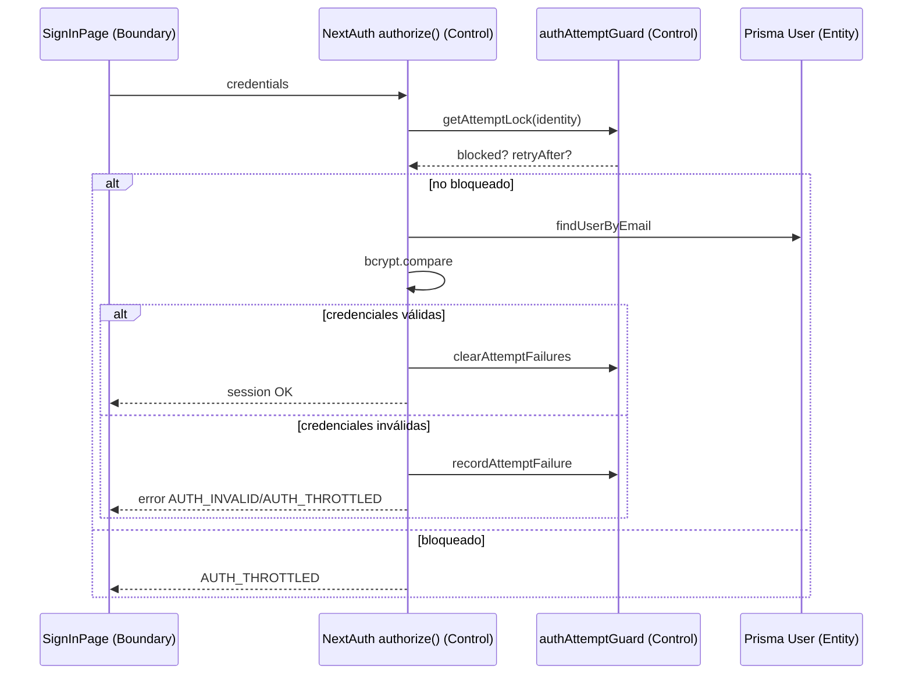
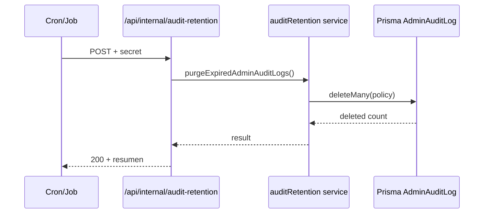

# 06. Diagramas de Realización de Casos de Uso

## 1. Realización CU-003 (Postular a vacante)

```mermaid
sequenceDiagram
  participant UI as PostularForm (Boundary)
  participant API as API Applications (Control)
  participant VAL as Zod Validation (Control)
  participant BOT as Turnstile (External)
  participant DB as Prisma/PostgreSQL (Entity)
  participant FILE as UploadThing (External)
  participant MAIL as Resend (External)

  UI->>FILE: upload CV
  FILE-->>UI: resumeUrl/resumeKey
  UI->>API: POST /api/applications
  API->>VAL: validate(body)
  API->>BOT: verify(token)
  BOT-->>API: ok
  API->>DB: create(Application)
  API->>MAIL: notify admin
  API-->>UI: 201 Created
```

## 2. Realización CU-005 (Login admin)

```mermaid
sequenceDiagram
  participant UI as SignInPage (Boundary)
  participant AUTH as NextAuth authorize() (Control)
  participant GUARD as authAttemptGuard (Control)
  participant DB as Prisma User (Entity)

  UI->>AUTH: credentials
  AUTH->>GUARD: getAttemptLock(identity)
  GUARD-->>AUTH: blocked? retryAfter?
  alt no bloqueado
    AUTH->>DB: findUserByEmail
    AUTH->>AUTH: bcrypt.compare
    alt credenciales válidas
      AUTH->>GUARD: clearAttemptFailures
      AUTH-->>UI: session OK
    else credenciales inválidas
      AUTH->>GUARD: recordAttemptFailure
      AUTH-->>UI: error AUTH_INVALID/AUTH_THROTTLED
    end
  else bloqueado
    AUTH-->>UI: AUTH_THROTTLED
  end
```

## 3. Realización CU-022 (Purge auditoría)

```mermaid
sequenceDiagram
  participant CRON as Cron/Job
  participant API as /api/internal/audit-retention
  participant SVC as auditRetention service
  participant DB as Prisma AdminAuditLog

  CRON->>API: POST + secret
  API->>SVC: purgeExpiredAdminAuditLogs()
  SVC->>DB: deleteMany(policy)
  DB-->>SVC: deleted count
  SVC-->>API: result
  API-->>CRON: 200 + resumen
```
