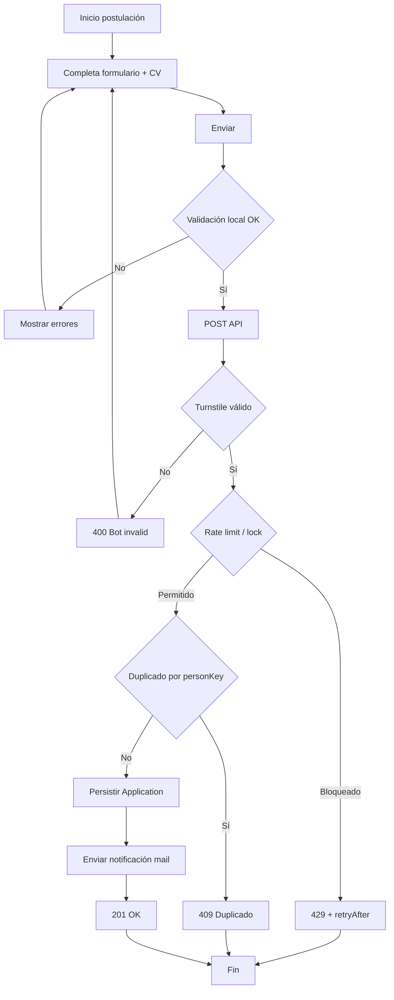
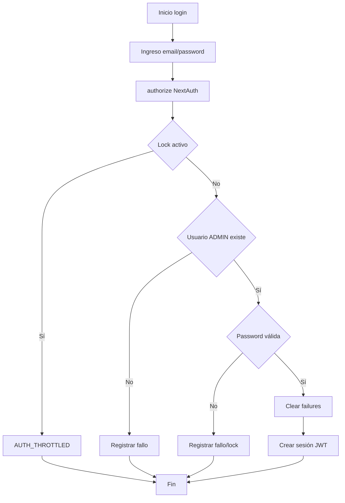
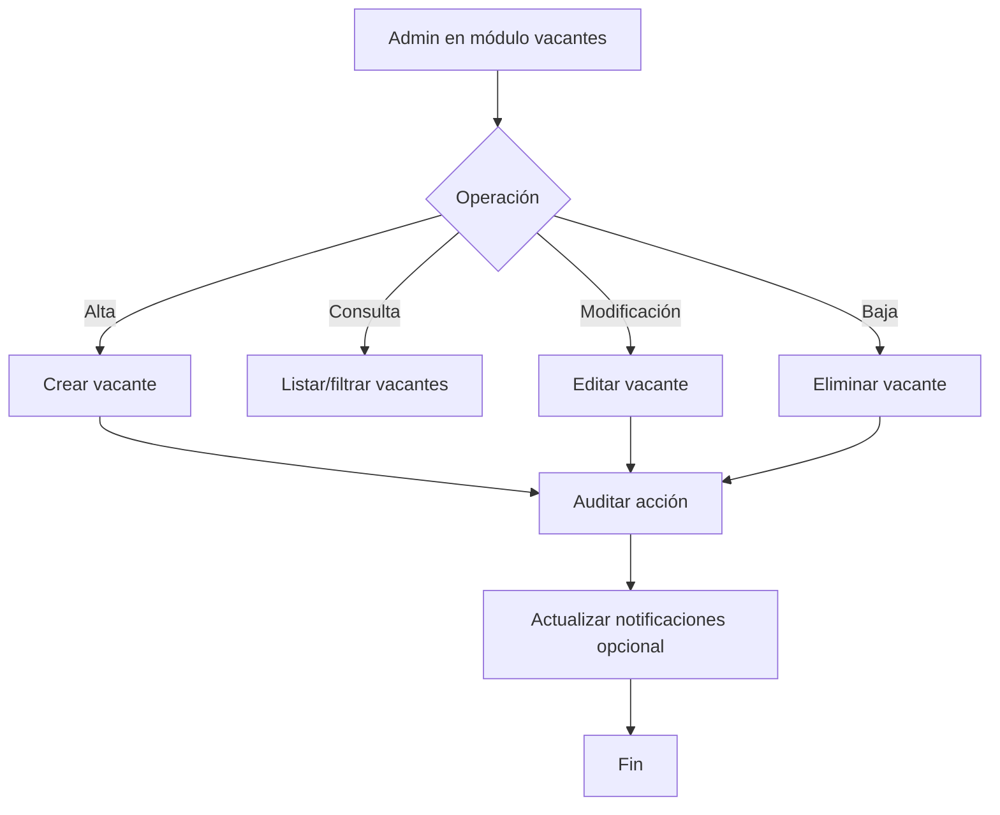

# 09. Diagramas de Flujo (Normal + Alternativos)

## 1. Flujo: Postulación

```mermaid
flowchart TD
  A[Inicio postulación] --> B[Completa formulario + CV]
  B --> C[Enviar]
  C --> D{Validación local OK}
  D -- No --> D1[Mostrar errores] --> B
  D -- Sí --> E[POST API]
  E --> F{Turnstile válido}
  F -- No --> F1[400 Bot invalid] --> B
  F -- Sí --> G{Rate limit / lock}
  G -- Bloqueado --> G1[429 + retryAfter] --> H[Fin]
  G -- Permitido --> I{Duplicado por personKey}
  I -- Sí --> I1[409 Duplicado] --> H
  I -- No --> J[Persistir Application]
  J --> K[Enviar notificación mail]
  K --> L[201 OK]
  L --> H[Fin]
```

## 2. Flujo: Login Admin

```mermaid
flowchart TD
  A[Inicio login] --> B[Ingreso email/password]
  B --> C[authorize NextAuth]
  C --> D{Lock activo}
  D -- Sí --> D1[AUTH_THROTTLED] --> Z[Fin]
  D -- No --> E{Usuario ADMIN existe}
  E -- No --> E1[Registrar fallo] --> Z
  E -- Sí --> F{Password válida}
  F -- No --> F1[Registrar fallo/lock] --> Z
  F -- Sí --> G[Clear failures]
  G --> H[Crear sesión JWT]
  H --> Z[Fin]
```

## 3. Flujo: Gestión de vacante (ABCM)

```mermaid
flowchart TD
  A[Admin en módulo vacantes] --> B{Operación}
  B -- Alta --> C[Crear vacante]
  B -- Consulta --> D[Listar/filtrar vacantes]
  B -- Modificación --> E[Editar vacante]
  B -- Baja --> F[Eliminar vacante]

  C --> G[Auditar acción]
  E --> G
  F --> G
  G --> H[Actualizar notificaciones opcional]
  H --> I[Fin]
```
