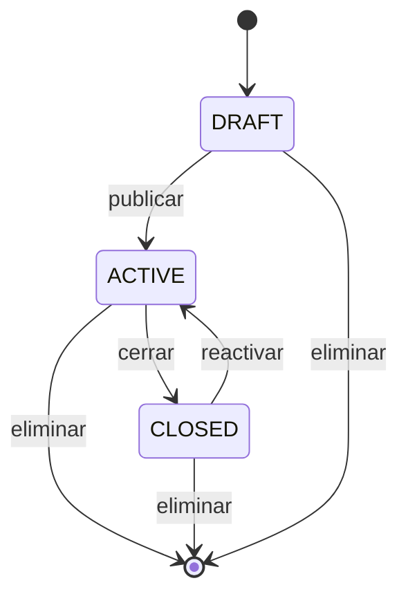
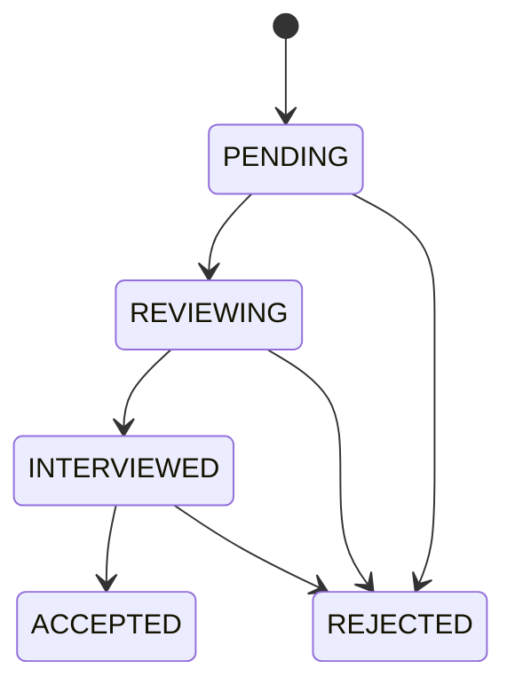
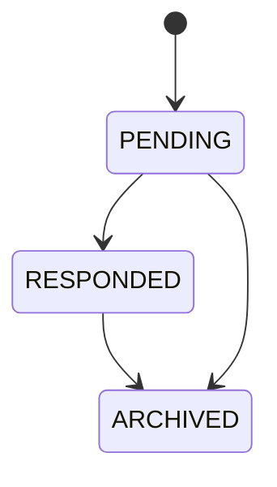
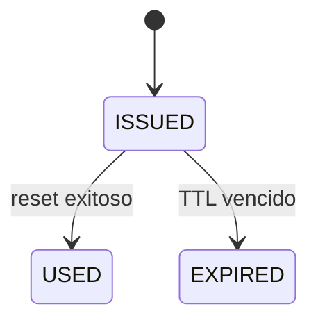
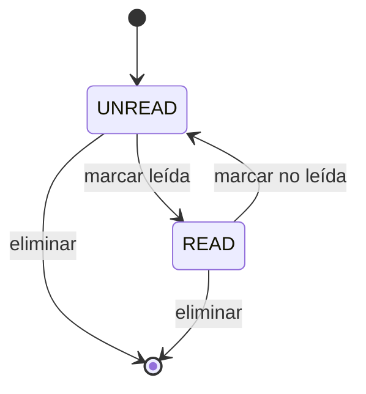

# 10. Diagramas de Máquinas de Estado

## 1. Estado de Vacancy

```mermaid
stateDiagram-v2
  [*] --> DRAFT
  DRAFT --> ACTIVE: publicar
  ACTIVE --> CLOSED: cerrar
  CLOSED --> ACTIVE: reactivar
  ACTIVE --> [*]: eliminar
  CLOSED --> [*]: eliminar
  DRAFT --> [*]: eliminar
```

## 2. Estado de Application

```mermaid
stateDiagram-v2
  [*] --> PENDING
  PENDING --> REVIEWING
  REVIEWING --> INTERVIEWED
  INTERVIEWED --> ACCEPTED
  INTERVIEWED --> REJECTED
  PENDING --> REJECTED
  REVIEWING --> REJECTED
```

## 3. Estado de Contact

```mermaid
stateDiagram-v2
  [*] --> PENDING
  PENDING --> RESPONDED
  RESPONDED --> ARCHIVED
  PENDING --> ARCHIVED
```

## 4. Estado de PasswordResetToken

```mermaid
stateDiagram-v2
  [*] --> ISSUED
  ISSUED --> USED: reset exitoso
  ISSUED --> EXPIRED: TTL vencido
```

## 5. Estado de AdminNotification

```mermaid
stateDiagram-v2
  [*] --> UNREAD
  UNREAD --> READ: marcar leída
  READ --> UNREAD: marcar no leída
  UNREAD --> [*]: eliminar
  READ --> [*]: eliminar
```
