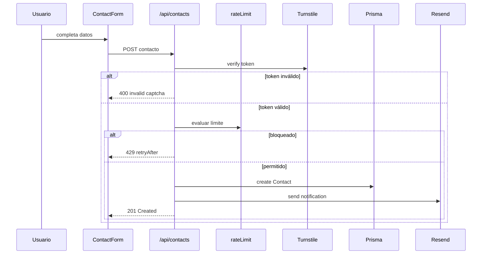
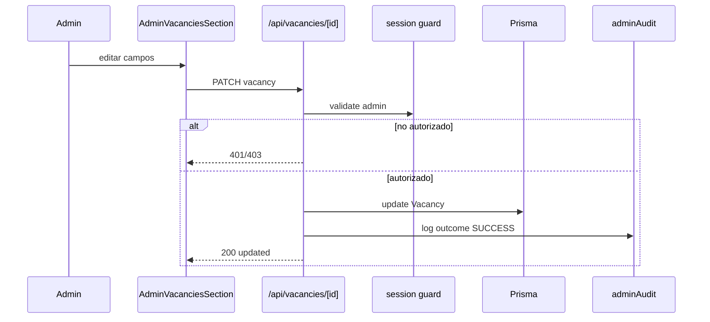
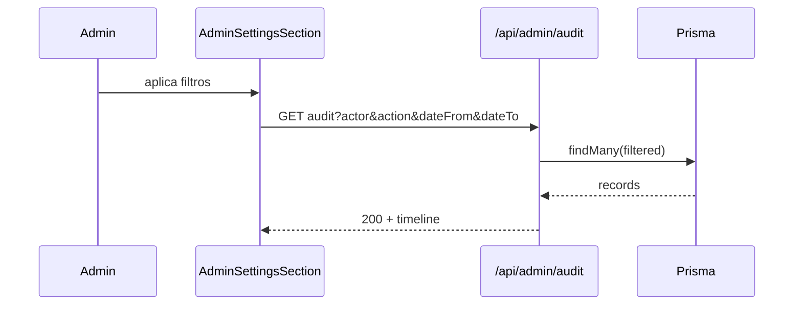

# 13. Diagramas de Secuencia

## 1. CU-004 Enviar contacto (normal + alternativo)

```mermaid
sequenceDiagram
  participant U as Usuario
  participant UI as ContactForm
  participant API as /api/contacts
  participant RL as rateLimit
  participant BOT as Turnstile
  participant DB as Prisma
  participant MAIL as Resend

  U->>UI: completa datos
  UI->>API: POST contacto
  API->>BOT: verify token
  alt token inválido
    API-->>UI: 400 invalid captcha
  else token válido
    API->>RL: evaluar límite
    alt bloqueado
      API-->>UI: 429 retryAfter
    else permitido
      API->>DB: create Contact
      API->>MAIL: send notification
      API-->>UI: 201 Created
    end
  end
```

## 2. CU-009 Modificar vacante

```mermaid
sequenceDiagram
  participant A as Admin
  participant UI as AdminVacanciesSection
  participant API as /api/vacancies/[id]
  participant AUTH as session guard
  participant DB as Prisma
  participant AUD as adminAudit

  A->>UI: editar campos
  UI->>API: PATCH vacancy
  API->>AUTH: validate admin
  alt no autorizado
    API-->>UI: 401/403
  else autorizado
    API->>DB: update Vacancy
    API->>AUD: log outcome SUCCESS
    API-->>UI: 200 updated
  end
```

## 3. CU-021 Consultar auditoría

```mermaid
sequenceDiagram
  participant A as Admin
  participant UI as AdminSettingsSection
  participant API as /api/admin/audit
  participant DB as Prisma

  A->>UI: aplica filtros
  UI->>API: GET audit?actor&action&dateFrom&dateTo
  API->>DB: findMany(filtered)
  DB-->>API: records
  API-->>UI: 200 + timeline
```
