# 17. Diagramas por CU Operativo (Flujo + Secuencia)

## 1. Convención de numeración uniforme

- `Figura 17-XXX-F`: diagrama de flujo del CU.
- `Figura 17-XXX-S`: diagrama de secuencia del CU.
- Donde `XXX` coincide con el número del CU (ejemplo: CU-003 -> 17-003-F / 17-003-S).

## 2. Índice de figuras

| ID figura | CU | Tipo |
|---|---|---|
| Figura 17-001-F | CU-001 | Flujo |
| Figura 17-001-S | CU-001 | Secuencia |
| Figura 17-002-F | CU-002 | Flujo |
| Figura 17-002-S | CU-002 | Secuencia |
| Figura 17-003-F | CU-003 | Flujo |
| Figura 17-003-S | CU-003 | Secuencia |
| Figura 17-004-F | CU-004 | Flujo |
| Figura 17-004-S | CU-004 | Secuencia |
| Figura 17-005-F | CU-005 | Flujo |
| Figura 17-005-S | CU-005 | Secuencia |
| Figura 17-006-F | CU-006 | Flujo |
| Figura 17-006-S | CU-006 | Secuencia |
| Figura 17-007-F | CU-007 | Flujo |
| Figura 17-007-S | CU-007 | Secuencia |
| Figura 17-008-F | CU-008 | Flujo |
| Figura 17-008-S | CU-008 | Secuencia |
| Figura 17-009-F | CU-009 | Flujo |
| Figura 17-009-S | CU-009 | Secuencia |
| Figura 17-010-F | CU-010 | Flujo |
| Figura 17-010-S | CU-010 | Secuencia |
| Figura 17-011-F | CU-011 | Flujo |
| Figura 17-011-S | CU-011 | Secuencia |
| Figura 17-012-F | CU-012 | Flujo |
| Figura 17-012-S | CU-012 | Secuencia |
| Figura 17-013-F | CU-013 | Flujo |
| Figura 17-013-S | CU-013 | Secuencia |
| Figura 17-014-F | CU-014 | Flujo |
| Figura 17-014-S | CU-014 | Secuencia |
| Figura 17-015-F | CU-015 | Flujo |
| Figura 17-015-S | CU-015 | Secuencia |
| Figura 17-016-F | CU-016 | Flujo |
| Figura 17-016-S | CU-016 | Secuencia |
| Figura 17-017-F | CU-017 | Flujo |
| Figura 17-017-S | CU-017 | Secuencia |
| Figura 17-018-F | CU-018 | Flujo |
| Figura 17-018-S | CU-018 | Secuencia |
| Figura 17-019-F | CU-019 | Flujo |
| Figura 17-019-S | CU-019 | Secuencia |
| Figura 17-020-F | CU-020 | Flujo |
| Figura 17-020-S | CU-020 | Secuencia |
| Figura 17-021-F | CU-021 | Flujo |
| Figura 17-021-S | CU-021 | Secuencia |
| Figura 17-022-F | CU-022 | Flujo |
| Figura 17-022-S | CU-022 | Secuencia |

## 3. CU-001 Consultar vacantes públicas (Figura 17-001-F / Figura 17-001-S)
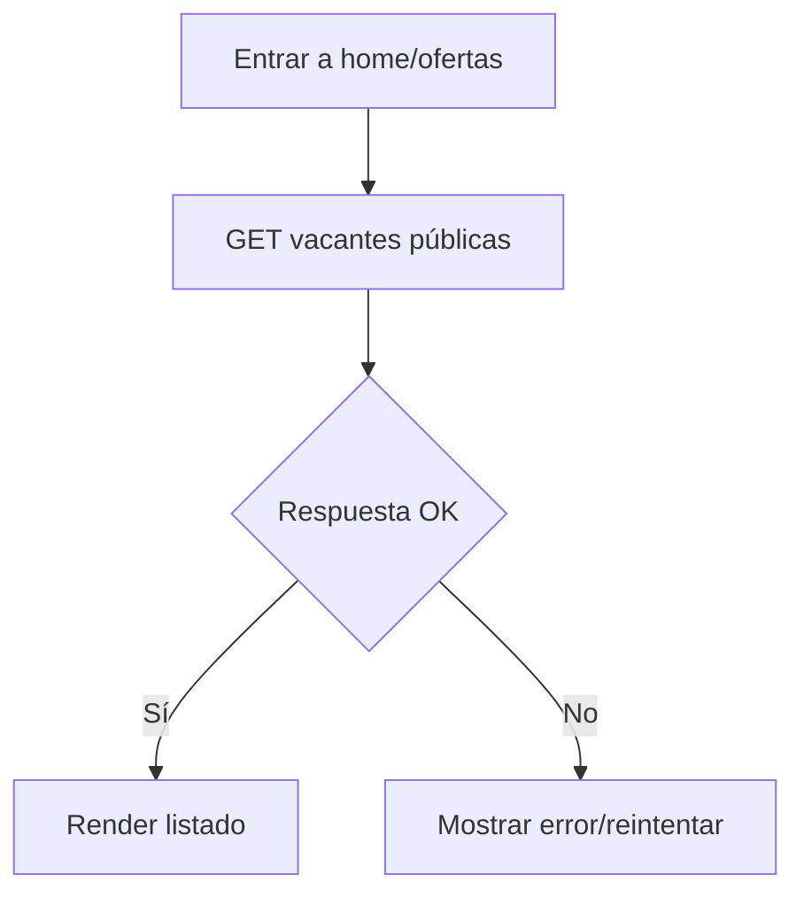
```mermaid
flowchart TD
  A[Entrar a home/ofertas] --> B[GET vacantes públicas]
  B --> C{Respuesta OK}
  C -- Sí --> D[Render listado]
  C -- No --> E[Mostrar error/reintentar]
```
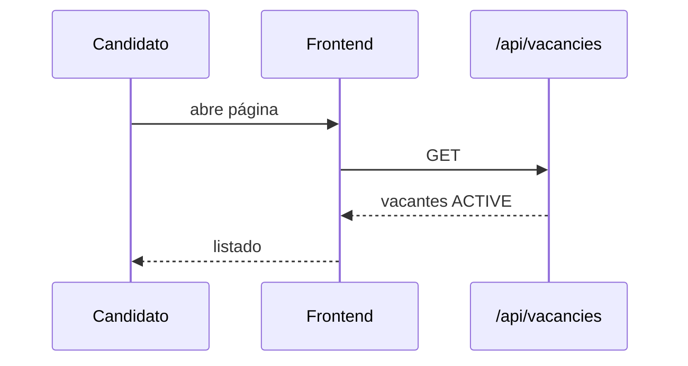
```mermaid
sequenceDiagram
  participant U as Candidato
  participant UI as Frontend
  participant API as /api/vacancies
  U->>UI: abre página
  UI->>API: GET
  API-->>UI: vacantes ACTIVE
  UI-->>U: listado
```

## 4. CU-002 Filtrar vacantes públicas (Figura 17-002-F / Figura 17-002-S)
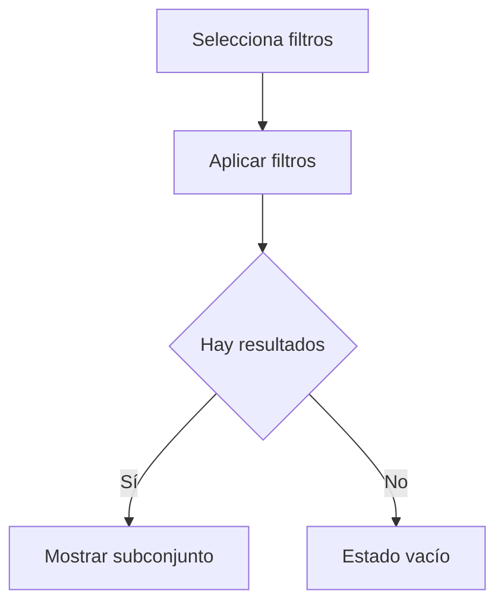
```mermaid
flowchart TD
  A[Selecciona filtros] --> B[Aplicar filtros]
  B --> C{Hay resultados}
  C -- Sí --> D[Mostrar subconjunto]
  C -- No --> E[Estado vacío]
```
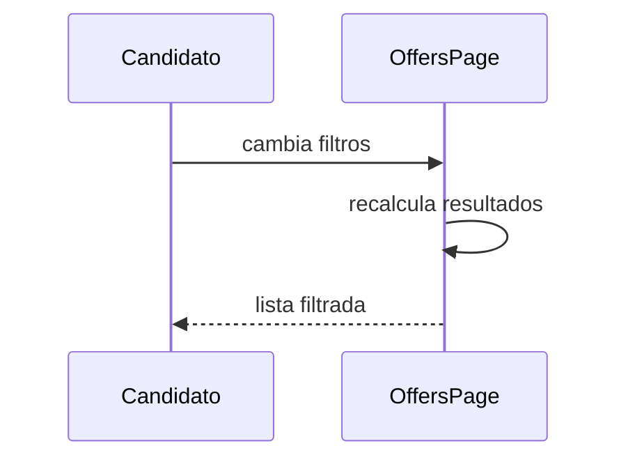
```mermaid
sequenceDiagram
  participant U as Candidato
  participant UI as OffersPage
  U->>UI: cambia filtros
  UI->>UI: recalcula resultados
  UI-->>U: lista filtrada
```

## 5. CU-003 Postular a vacante (Figura 17-003-F / Figura 17-003-S)
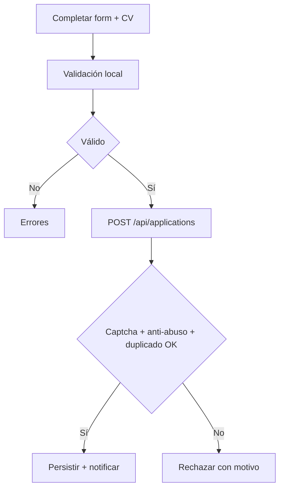
```mermaid
flowchart TD
  A[Completar form + CV] --> B[Validación local]
  B --> C{Válido}
  C -- No --> X[Errores]
  C -- Sí --> D[POST /api/applications]
  D --> E{Captcha + anti-abuso + duplicado OK}
  E -- Sí --> F[Persistir + notificar]
  E -- No --> G[Rechazar con motivo]
```
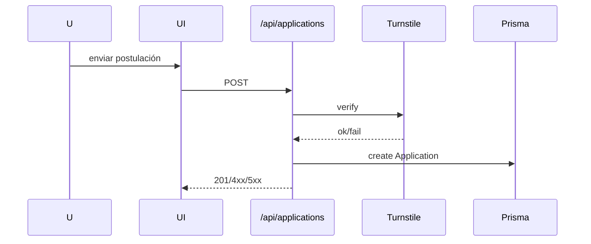
```mermaid
sequenceDiagram
  participant U
  participant UI
  participant API as /api/applications
  participant BOT as Turnstile
  participant DB as Prisma
  U->>UI: enviar postulación
  UI->>API: POST
  API->>BOT: verify
  BOT-->>API: ok/fail
  API->>DB: create Application
  API-->>UI: 201/4xx/5xx
```

## 6. CU-004 Enviar contacto (Figura 17-004-F / Figura 17-004-S)
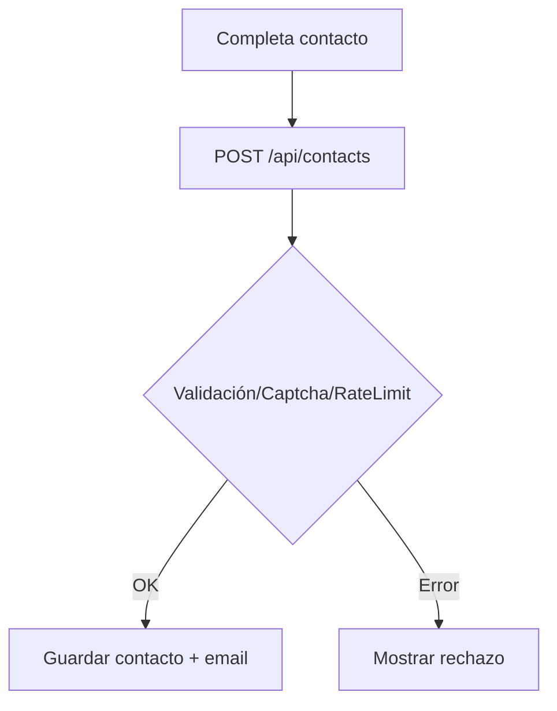
```mermaid
flowchart TD
  A[Completa contacto] --> B[POST /api/contacts]
  B --> C{Validación/Captcha/RateLimit}
  C -- OK --> D[Guardar contacto + email]
  C -- Error --> E[Mostrar rechazo]
```
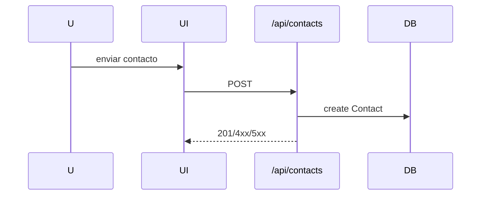
```mermaid
sequenceDiagram
  participant U
  participant UI
  participant API as /api/contacts
  participant DB
  U->>UI: enviar contacto
  UI->>API: POST
  API->>DB: create Contact
  API-->>UI: 201/4xx/5xx
```

## 7. CU-005 Iniciar sesión admin (Figura 17-005-F / Figura 17-005-S)
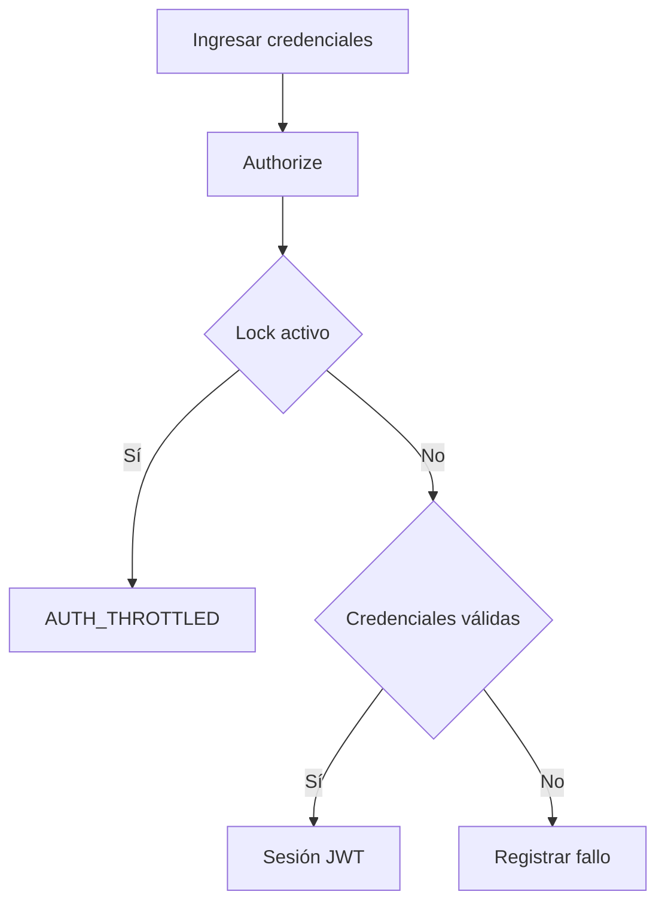
```mermaid
flowchart TD
  A[Ingresar credenciales] --> B[Authorize]
  B --> C{Lock activo}
  C -- Sí --> X[AUTH_THROTTLED]
  C -- No --> D{Credenciales válidas}
  D -- Sí --> E[Sesión JWT]
  D -- No --> F[Registrar fallo]
```
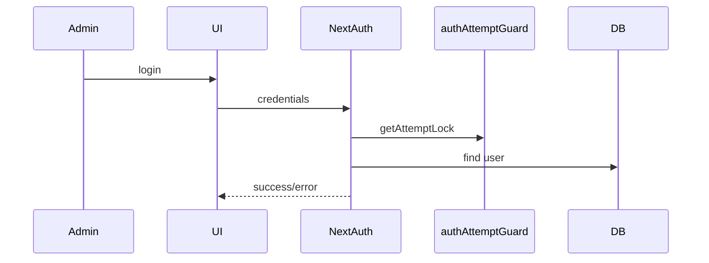
```mermaid
sequenceDiagram
  participant U as Admin
  participant UI
  participant AUTH as NextAuth
  participant GUARD as authAttemptGuard
  participant DB
  U->>UI: login
  UI->>AUTH: credentials
  AUTH->>GUARD: getAttemptLock
  AUTH->>DB: find user
  AUTH-->>UI: success/error
```

## 8. CU-006 Recuperar contraseña admin (Figura 17-006-F / Figura 17-006-S)
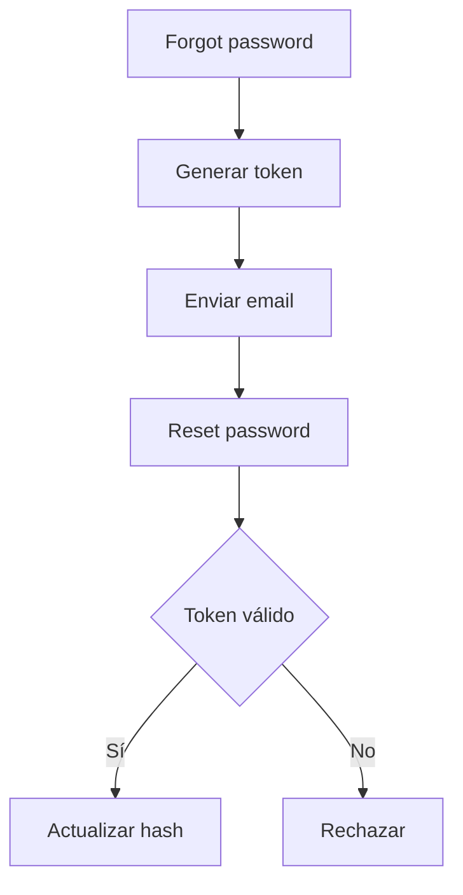
```mermaid
flowchart TD
  A[Forgot password] --> B[Generar token]
  B --> C[Enviar email]
  C --> D[Reset password]
  D --> E{Token válido}
  E -- Sí --> F[Actualizar hash]
  E -- No --> X[Rechazar]
```
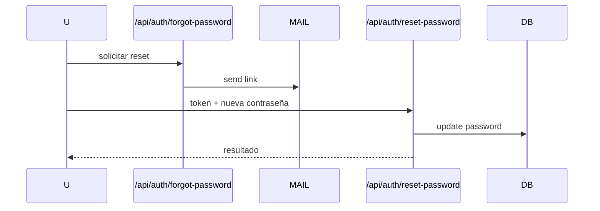
```mermaid
sequenceDiagram
  participant U
  participant API1 as /api/auth/forgot-password
  participant MAIL
  participant API2 as /api/auth/reset-password
  participant DB
  U->>API1: solicitar reset
  API1->>MAIL: send link
  U->>API2: token + nueva contraseña
  API2->>DB: update password
  API2-->>U: resultado
```

## 9. CU-007 Alta vacante (Figura 17-007-F / Figura 17-007-S)
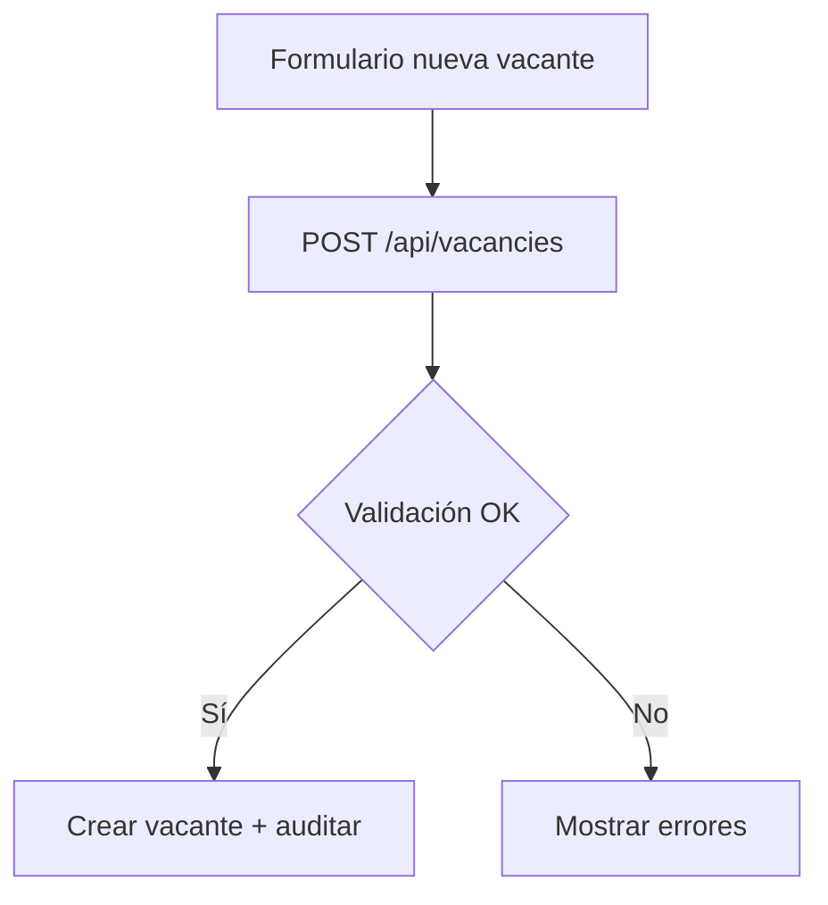
```mermaid
flowchart TD
  A[Formulario nueva vacante] --> B[POST /api/vacancies]
  B --> C{Validación OK}
  C -- Sí --> D[Crear vacante + auditar]
  C -- No --> E[Mostrar errores]
```
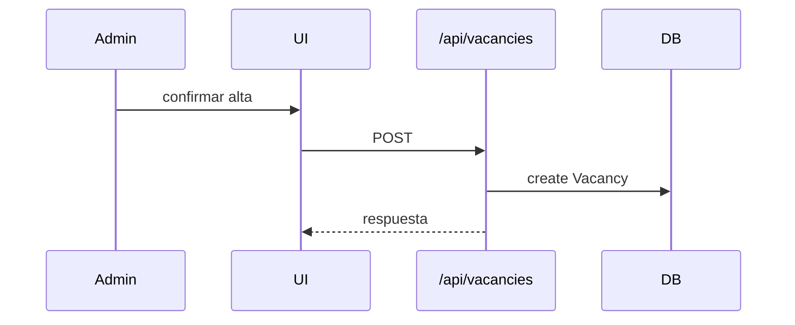
```mermaid
sequenceDiagram
  participant A as Admin
  participant UI
  participant API as /api/vacancies
  participant DB
  A->>UI: confirmar alta
  UI->>API: POST
  API->>DB: create Vacancy
  API-->>UI: respuesta
```

## 10. CU-008 Consulta vacantes admin (Figura 17-008-F / Figura 17-008-S)
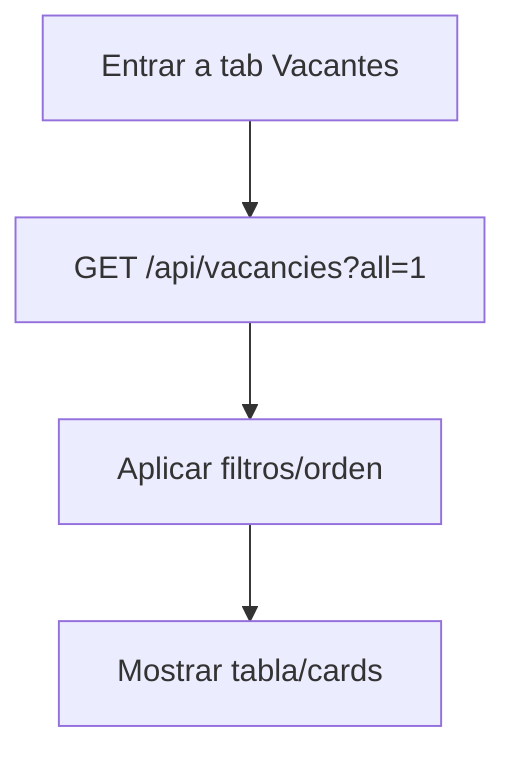
```mermaid
flowchart TD
  A[Entrar a tab Vacantes] --> B[GET /api/vacancies?all=1]
  B --> C[Aplicar filtros/orden]
  C --> D[Mostrar tabla/cards]
```
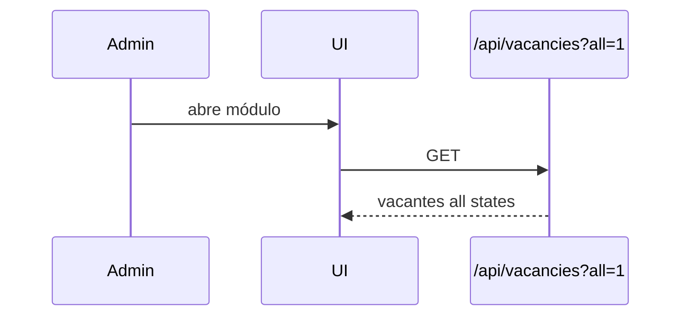
```mermaid
sequenceDiagram
  participant A as Admin
  participant UI
  participant API as /api/vacancies?all=1
  A->>UI: abre módulo
  UI->>API: GET
  API-->>UI: vacantes all states
```

## 11. CU-009 Modificación vacante (Figura 17-009-F / Figura 17-009-S)
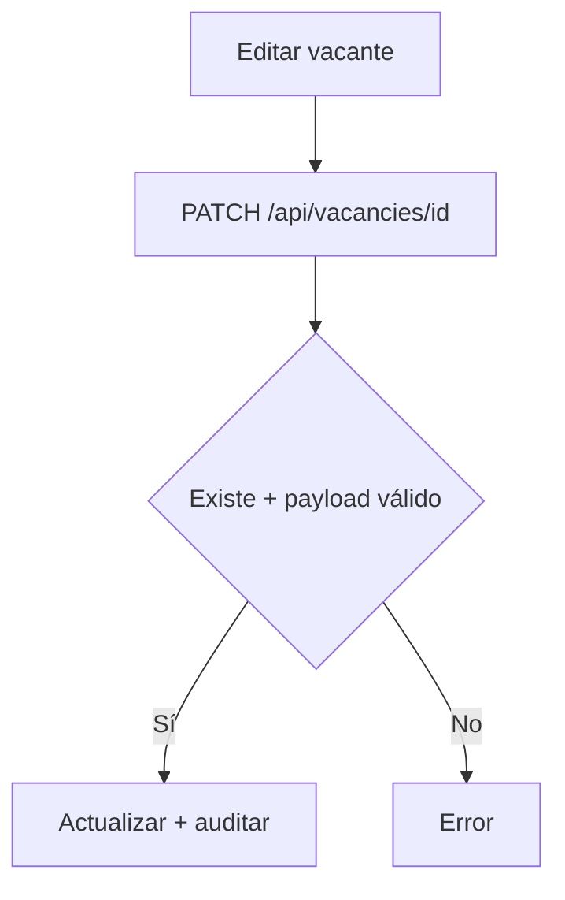
```mermaid
flowchart TD
  A[Editar vacante] --> B[PATCH /api/vacancies/id]
  B --> C{Existe + payload válido}
  C -- Sí --> D[Actualizar + auditar]
  C -- No --> E[Error]
```
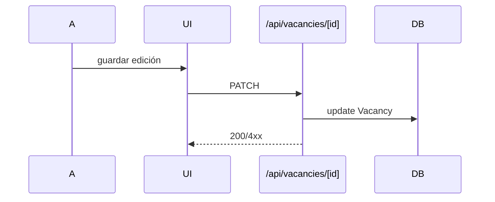
```mermaid
sequenceDiagram
  participant A
  participant UI
  participant API as /api/vacancies/[id]
  participant DB
  A->>UI: guardar edición
  UI->>API: PATCH
  API->>DB: update Vacancy
  API-->>UI: 200/4xx
```

## 12. CU-010 Baja vacante (Figura 17-010-F / Figura 17-010-S)
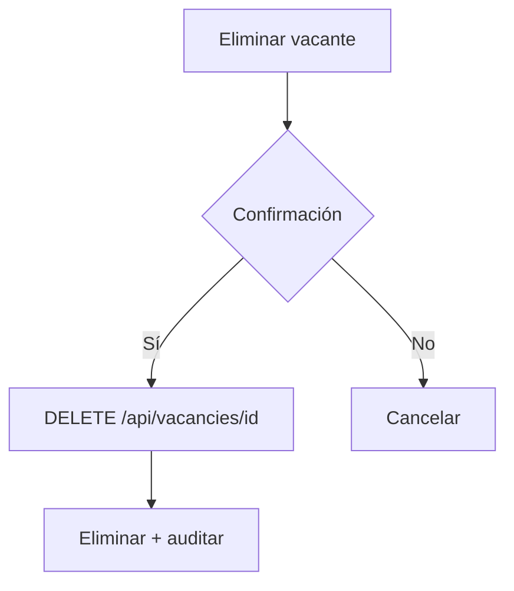
```mermaid
flowchart TD
  A[Eliminar vacante] --> B{Confirmación}
  B -- Sí --> C[DELETE /api/vacancies/id]
  C --> D[Eliminar + auditar]
  B -- No --> X[Cancelar]
```
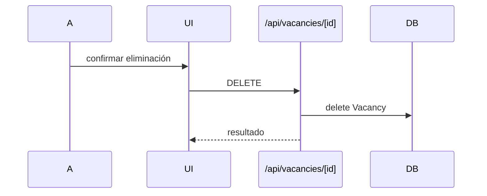
```mermaid
sequenceDiagram
  participant A
  participant UI
  participant API as /api/vacancies/[id]
  participant DB
  A->>UI: confirmar eliminación
  UI->>API: DELETE
  API->>DB: delete Vacancy
  API-->>UI: resultado
```

## 13. CU-011 Consulta postulaciones (Figura 17-011-F / Figura 17-011-S)
```mermaid
flowchart TD
  A[Entrar tab Postulaciones] --> B[GET /api/applications]
  B --> C[Filtrar/ordenar]
  C --> D[Mostrar lista]
```
```mermaid
sequenceDiagram
  participant A
  participant UI
  participant API as /api/applications
  A->>UI: abre módulo
  UI->>API: GET
  API-->>UI: lista
```

## 14. CU-012 Ver detalle postulación (Figura 17-012-F / Figura 17-012-S)
```mermaid
flowchart TD
  A[Click Ver] --> B[GET /api/applications/id]
  B --> C{Existe}
  C -- Sí --> D[Mostrar diálogo]
  C -- No --> E[Error]
```
```mermaid
sequenceDiagram
  participant A
  participant UI
  participant API as /api/applications/[id]
  A->>UI: ver detalle
  UI->>API: GET
  API-->>UI: detalle/404
```

## 15. CU-013 Modificación estado postulación (Figura 17-013-F / Figura 17-013-S)
```mermaid
flowchart TD
  A[Cambiar estado] --> B[PATCH /api/applications/id]
  B --> C{Estado válido}
  C -- Sí --> D[Persistir + auditar]
  C -- No --> E[Error]
```
```mermaid
sequenceDiagram
  participant A
  participant UI
  participant API as /api/applications/[id]
  participant DB
  A->>UI: seleccionar estado
  UI->>API: PATCH
  API->>DB: update status
  API-->>UI: respuesta
```

## 16. CU-014 Baja postulación (Figura 17-014-F / Figura 17-014-S)
```mermaid
flowchart TD
  A[Eliminar postulación] --> B{Confirmación}
  B -- Sí --> C[DELETE /api/applications/id]
  C --> D[Eliminar + auditar]
  B -- No --> X[Cancelar]
```
```mermaid
sequenceDiagram
  participant A
  participant UI
  participant API as /api/applications/[id]
  participant DB
  A->>UI: confirmar eliminar
  UI->>API: DELETE
  API->>DB: delete
  API-->>UI: resultado
```

## 17. CU-015 Consulta contactos (Figura 17-015-F / Figura 17-015-S)
```mermaid
flowchart TD
  A[Entrar tab Contactos] --> B[GET /api/contacts]
  B --> C[Aplicar filtros]
  C --> D[Listar resultados]
```
```mermaid
sequenceDiagram
  participant A
  participant UI
  participant API as /api/contacts
  A->>UI: abre módulo
  UI->>API: GET
  API-->>UI: contactos
```

## 18. CU-016 Ver detalle contacto (Figura 17-016-F / Figura 17-016-S)
```mermaid
flowchart TD
  A[Click Ver contacto] --> B[GET /api/contacts/id]
  B --> C{Existe}
  C -- Sí --> D[Mostrar detalle]
  C -- No --> E[Error]
```
```mermaid
sequenceDiagram
  participant A
  participant UI
  participant API as /api/contacts/[id]
  A->>UI: ver detalle
  UI->>API: GET
  API-->>UI: detalle/404
```

## 19. CU-017 Modificación estado contacto (Figura 17-017-F / Figura 17-017-S)
```mermaid
flowchart TD
  A[Cambiar estado contacto] --> B[PATCH /api/contacts/id]
  B --> C{Estado válido}
  C -- Sí --> D[Persistir + auditar]
  C -- No --> E[Error]
```
```mermaid
sequenceDiagram
  participant A
  participant UI
  participant API as /api/contacts/[id]
  participant DB
  A->>UI: seleccionar estado
  UI->>API: PATCH
  API->>DB: update status
  API-->>UI: resultado
```

## 20. CU-018 Baja contacto (Figura 17-018-F / Figura 17-018-S)
```mermaid
flowchart TD
  A[Eliminar contacto] --> B{Confirmación}
  B -- Sí --> C[DELETE /api/contacts/id]
  C --> D[Eliminar + auditar]
  B -- No --> X[Cancelar]
```
```mermaid
sequenceDiagram
  participant A
  participant UI
  participant API as /api/contacts/[id]
  participant DB
  A->>UI: confirmar eliminar
  UI->>API: DELETE
  API->>DB: delete
  API-->>UI: resultado
```

## 21. CU-019 Configurar preferencias admin (Figura 17-019-F / Figura 17-019-S)
```mermaid
flowchart TD
  A[Abrir configuración] --> B[GET /api/admin/settings]
  B --> C[Modificar switches]
  C --> D[PATCH /api/admin/settings]
  D --> E[Guardar configuración]
```
```mermaid
sequenceDiagram
  participant A
  participant UI
  participant API as /api/admin/settings
  participant DB
  A->>UI: abrir settings
  UI->>API: GET
  UI->>API: PATCH
  API->>DB: upsert settings
  API-->>UI: resultado
```

## 22. CU-020 Gestionar notificaciones admin (Figura 17-020-F / Figura 17-020-S)
```mermaid
flowchart TD
  A[Abrir panel notificaciones] --> B[GET /api/admin/notifications]
  B --> C{Acción}
  C -- Marcar --> D[PATCH /api/admin/notifications/id]
  C -- Eliminar --> E[DELETE /api/admin/notifications/id]
  C -- Limpiar leídas --> F[DELETE /api/admin/notifications]
```
```mermaid
sequenceDiagram
  participant A
  participant UI
  participant API as /api/admin/notifications
  participant DB
  A->>UI: abrir panel
  UI->>API: GET
  A->>UI: marcar/eliminar
  UI->>API: PATCH/DELETE
  API->>DB: update/delete
  API-->>UI: estado actualizado
```

## 23. CU-021 Consultar auditoría (Figura 17-021-F / Figura 17-021-S)
```mermaid
flowchart TD
  A[Abrir auditoría] --> B[GET /api/admin/audit]
  B --> C[Aplicar filtros]
  C --> D[Render timeline]
```
```mermaid
sequenceDiagram
  participant A
  participant UI
  participant API as /api/admin/audit
  participant DB
  A->>UI: set filtros
  UI->>API: GET con query
  API->>DB: findMany
  API-->>UI: timeline
```

## 24. CU-022 Ejecutar purga auditoría (Figura 17-022-F / Figura 17-022-S)
```mermaid
flowchart TD
  A[Cron invoca endpoint interno] --> B[Validar secret]
  B --> C{Secret válido}
  C -- Sí --> D[Purgar por retención]
  C -- No --> E[401/403]
  D --> F[Retornar resumen]
```
```mermaid
sequenceDiagram
  participant CRON
  participant API as /api/internal/audit-retention
  participant SVC as auditRetention
  participant DB
  CRON->>API: POST + secret
  API->>SVC: purge()
  SVC->>DB: deleteMany expirados
  API-->>CRON: resumen
```
